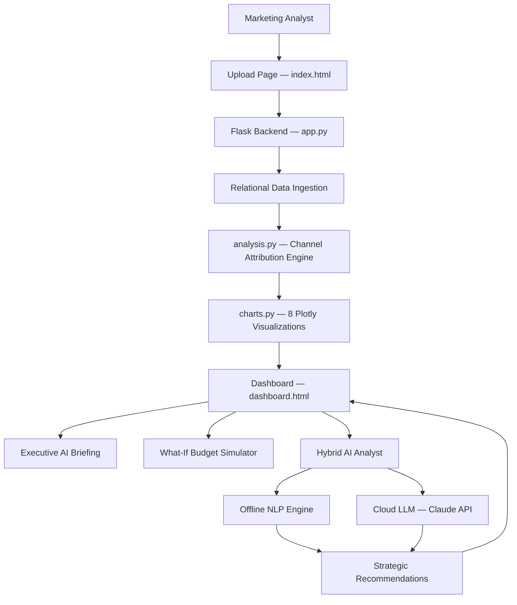

# MarketLens

### E-Commerce Marketing ROI Intelligence Platform

MarketLens is an end-to-end marketing analytics platform that ingests raw e-commerce transactional CSVs, computes channel-level ROI metrics (ROAS, CAC, LTV/CAC), generates interactive visualizations, and provides AI-powered strategic recommendations — all from a single browser tab.

<p align="left">
  <a href="https://www.python.org/"></a>
  <a href="https://flask.palletsprojects.com/"></a>
  <a href="https://plotly.com/python/"></a>
  <a href="https://pandas.pydata.org/"></a>
  
  
</p>

---

## Overview

MarketLens is a **dashboard-first analytics application** built for e-commerce marketing teams to make data-driven budget decisions.

The system combines:

- Automated relational data ingestion from 6 raw CSV files
- Channel-level ROI computation (ROAS, CAC, LTV, Conversion Rate)
- 8 interactive Plotly visualizations with dark neon theme
- Executive AI briefing with growth vectors and budget bleed alerts
- What-If budget simulation with non-linear saturation curves
- Hybrid AI analyst (offline NLP engine + cloud LLM)
- 1-click CSV export and print-ready PDF reports

Rather than requiring manual spreadsheet analysis, MarketLens **automates the full pipeline** from raw transaction data to actionable investment recommendations.

---

### Dashboard

MarketLens provides a glassmorphism-styled dark dashboard with interactive charts, smart filter chips, channel drill-down modals, and a built-in AI analyst for conversational strategy queries.

<br>

> **Note:** Upload your own CSVs or click **⚡ LOAD SAMPLE DATA** for instant exploration.

---

## Problem Statement

E-commerce marketing teams work with fragmented transactional data spread across multiple files:

- **Orders** — purchase timestamps, statuses
- **Items** — product prices, seller mappings
- **Payments** — transaction amounts
- **Customers** — unique customer IDs
- **MQLs** — marketing qualified leads and their origins
- **Deals** — conversion from lead to seller

Translating this raw data into channel-level ROI metrics requires:

1. Joining and attributing data across all 6 tables
2. Computing CAC, ROAS, LTV, and conversion rates per channel
3. Visualizing performance across multiple dimensions
4. Simulating budget reallocation scenarios
5. Generating strategic recommendations

This workflow is manual, error-prone, and time-consuming in spreadsheets.

MarketLens automates the entire pipeline — **from CSV upload to strategic AI recommendations** — in under 2 seconds.

---

## Solution

The application follows a **layered pipeline architecture** with a deterministic analytics engine and a hybrid AI layer.



---

## Key Features

- **1-Second Relational Ingestion** — Joins 6 raw CSVs (orders, items, payments, customers, MQL, deals) into unified channel metrics automatically.
- **Executive AI Briefing** — 3-card banner surfacing Primary Growth Vector, Budget Bleed alerts, and Capital Reallocation recommendations.
- **8 Interactive Visualizations** — ROAS bars, CAC bars, Spend vs. Revenue scatter, ROAS donut, LTV/CAC bubble, Conversion funnel, Budget recommendations, and Cohort retention heatmap.
- **Channel Drill-Down Modal** — Click any channel row to inspect acquisition funnel stages, unit economics, and ROAS-tiered strategic playbook.
- **What-If Budget Simulator** — Non-linear saturation curve (Spend^0.82) computing projected net profit and blended ROAS in real time.
- **Smart Filter Chips** — 1-click presets for Scale (ROAS ≥ 4x), Bleeding (ROAS < 1x), and High LTV/CAC (≥ 3x) channels.
- **Hybrid AI Analyst** — Offline deterministic NLP for exact arithmetic + cloud Claude API for open-ended analysis, with automatic failover.
- **CSV Export & PDF Print** — Download analysis as CSV or generate print-ready executive reports.
- **Keyboard Shortcuts** — `1`/`2`/`3` for tab switching, `/` for search, `Esc` to dismiss modals.

---

## Why a Hybrid AI Approach?

MarketLens separates the AI layer into two distinct engines rather than relying on a single LLM.

This provides:

- **Zero hallucination** on numerical queries (offline NLP uses exact computed data)
- **Instant response** with no API latency for common questions
- **No API key required** for core functionality
- **Open-ended analysis** available via cloud LLM when needed
- **Automatic failover** from cloud errors to offline engine
- **Cost efficiency** — cloud API only used for complex, conversational queries

The offline engine handles budget cuts, best channels, reallocation blueprints, comparisons, and strategy queries using deterministic rule-matching against the computed dataset.

---

## Tech Stack

| Layer | Technology |
|-------|-----------|
| **Backend** | Python 3.10+, Flask, Pandas, NumPy |
| **Visualization** | Plotly 5.22 (8 chart types, dark theme) |
| **Frontend** | Vanilla HTML5, CSS3 (Glassmorphism), JavaScript |
| **AI — Offline** | Rule-based NLP Expert System (deterministic) |
| **AI — Cloud** | Anthropic Claude API (optional) |
| **Deployment** | Gunicorn, Render.com |

---

## Project Structure

```
MarketLens/
├── backend/
│   ├── app.py              # Flask server — routes, API endpoints, demo cache
│   ├── analysis.py          # Channel attribution engine — joins, computes ROI metrics
│   ├── charts.py            # 8 Plotly chart generators with dark neon styling
│   ├── Procfile             # Gunicorn process file for deployment
│   └── render.yaml          # Render.com service configuration
│
├── frontend/
│   ├── index.html           # Upload page — CSV ingestion, API key input, demo loader
│   └── dashboard.html       # Dashboard — charts, table, simulator, AI chat
│
├── notebooks/
│   ├── 01_eda.ipynb                  # Exploratory Data Analysis
│   ├── 02_channel_engineering.ipynb  # Channel attribution logic development
│   ├── 03_cohort_ltv.ipynb           # Cohort analysis & LTV computation
│   └── 04_budget_recommendation.ipynb # Budget optimization modeling
│
├── data/                    # Raw CSV data files (not committed)
├── reports/                 # Generated charts and recommendation exports
├── requirements.txt         # Python dependencies
├── .gitignore
└── README.md
```

---

## Quickstart

### Prerequisites

- Python 3.10+
- pip

### Installation

1. **Clone the repository**:

```bash
git clone https://github.com/Nish232003/Marketlens-ecommerce-roi.git
cd Marketlens-ecommerce-roi
```

2. **Create and activate a virtual environment**:

```bash
python -m venv .venv

# Windows:
.venv\Scripts\activate

# macOS / Linux:
source .venv/bin/activate
```

3. **Install dependencies**:

```bash
pip install -r requirements.txt
```

4. **Launch the application**:

```bash
python backend/app.py
```

5. Open **http://127.0.0.1:5000** in your browser.

6. Click **⚡ LOAD SAMPLE DATA** for instant exploration, or upload your own CSVs.

---

## CSV Input Format

MarketLens requires 6 CSV files with the following columns:

| File | Required Columns |
|------|-----------------|
| `orders.csv` | `order_id`, `customer_id`, `order_status`, `order_purchase_timestamp` |
| `items.csv` | `order_id`, `seller_id`, `price` |
| `payments.csv` | `order_id`, `payment_value` |
| `customers.csv` | `customer_id`, `customer_unique_id` |
| `mql.csv` | `mql_id`, `origin` |
| `deals.csv` | `mql_id`, `seller_id` |

---

## Deployment

### Render.com (Recommended)

1. Push your repository to GitHub.
2. Create a new **Web Service** on [Render.com](https://render.com).
3. Connect your GitHub repository.
4. Configure:
   - **Build Command**: `pip install -r requirements.txt`
   - **Start Command**: `gunicorn backend.app:app`
5. Deploy.

The application includes a pre-configured `Procfile` and `render.yaml` for streamlined deployment.

---

## Research Notebooks

The `notebooks/` directory contains the Jupyter notebooks used to develop and validate the analytics pipeline:

| Notebook | Description |
|----------|------------|
| `01_eda.ipynb` | Exploratory analysis of raw Olist e-commerce data |
| `02_channel_engineering.ipynb` | Channel attribution logic and ROI metric computation |
| `03_cohort_ltv.ipynb` | Customer cohort analysis and lifetime value modeling |
| `04_budget_recommendation.ipynb` | Budget optimization with diminishing returns simulation |

---

## License

This project is open source and available under the [MIT License](LICENSE).

---

<p align="center">Made with ❤️ by <strong>Nishita</strong></p>
